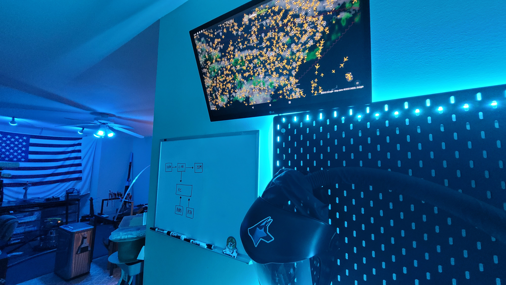
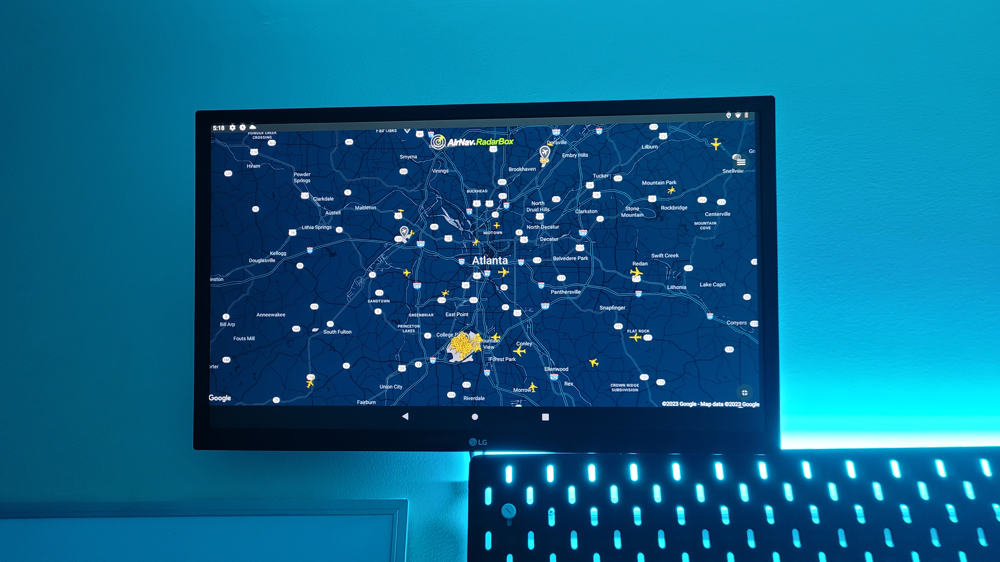

# Lab Dashboard (ADSB)

<figure><figcaption></figcaption></figure>

<figure><figcaption></figcaption></figure>

Old PC workstations and monitors can be turned into permanent dashboards for your labs. The dashboard can display various information such as notifications, various smart device statuses, camera feeds, etc. In our case, we turned our dashboard into an ADSB monitor for live updates on aviation happening around us. This is overall great use of both old computers that are too slow to be useful for anything and older monitors that may not have much use.&#x20;

