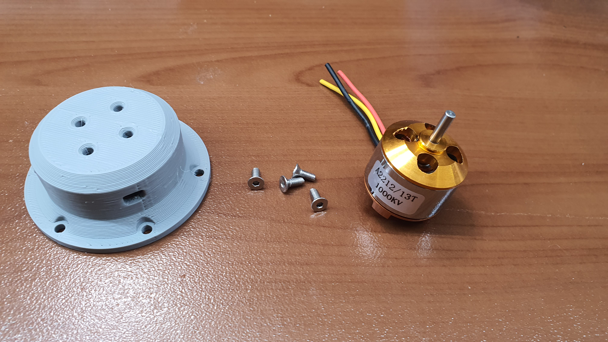
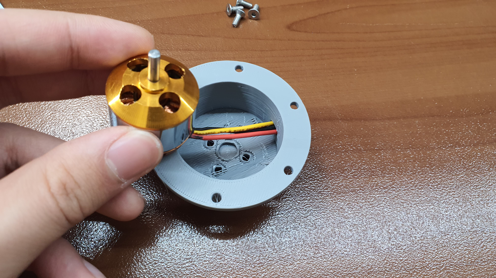
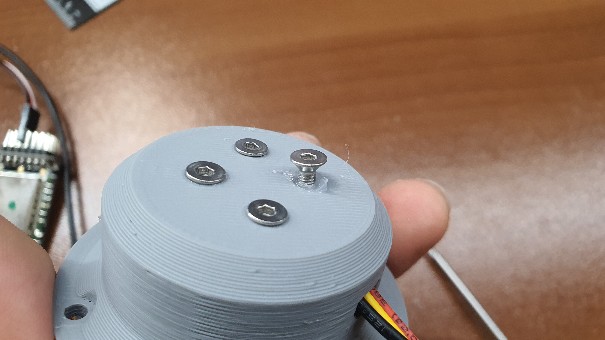
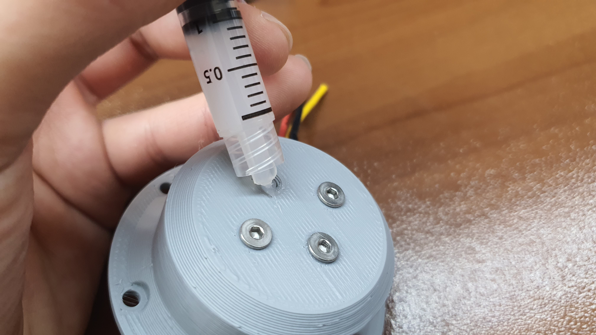
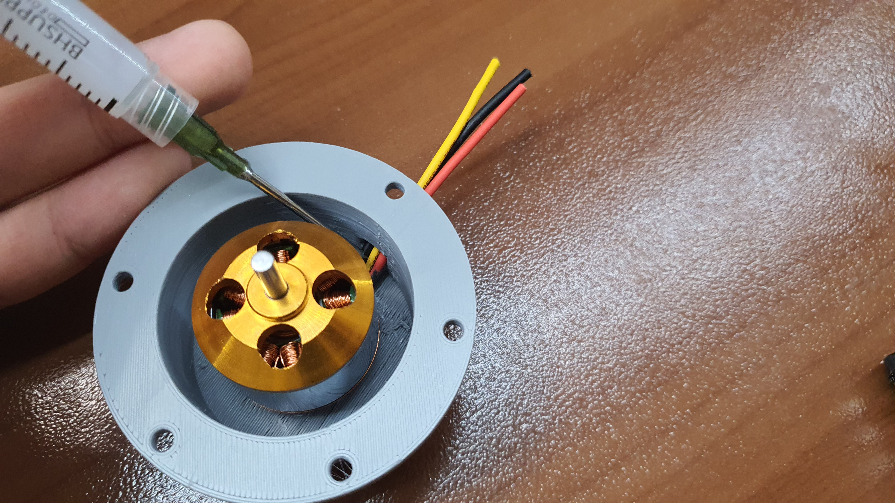
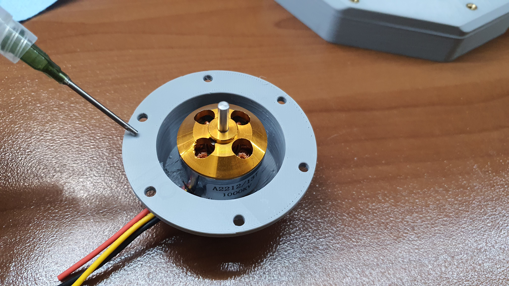
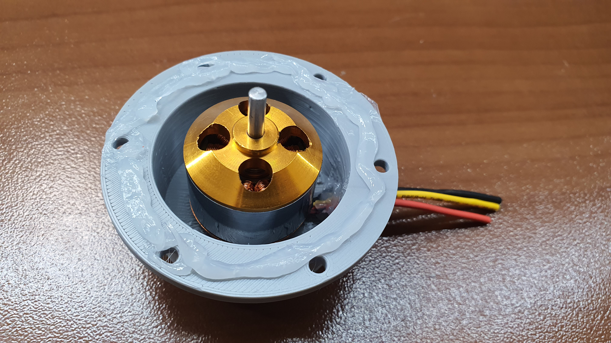
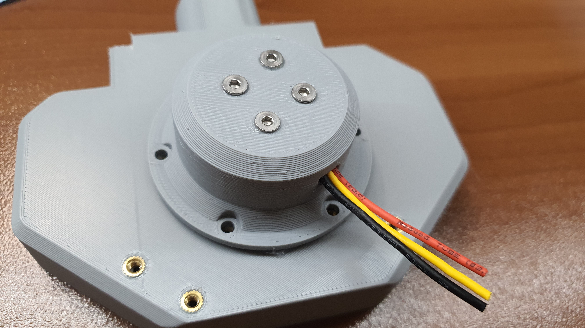

# Blower Module Assembly Manual

### Blower Module Assembly

<figure><figcaption></figcaption></figure>

kkk

## Parts

### Printed Parts List

| Parts             | Quantity | Link |
| ----------------- | -------- | ---- |
| Filter Cover      | 1x       |      |
| Center Frame      | 1x       |      |
| Back Cover        | 1x       |      |
| Dual Filter Mount | 1x       |      |
| Motor Mount       | 1x       |      |
| Fan Blade         | 1x       |      |
| Fan Enclosure     | 1x       |      |
| XT-60 Mount       | 1x       |      |
| Tube Mount Base   | 1x       |      |
| Pot Dial          | 1x       |      |

### Electronic Parts List

| Parts                                    | Quantity    | Link |
| ---------------------------------------- | ----------- | ---- |
| Arduino Nano (Micro is also okay)        | 1x          |      |
| Generic 30 amp ESC                       | 1x          |      |
| Generic 2212 drone motor (900 or 1000kv) | 1x          |      |
| 10K Potentiometer                        | 1x          |      |
| 16 Guage Silicone Wire                   | 1 Meter     |      |
| General Purpose Wire                     | 2 Meter     |      |
| Servo Wire                               | 0.25 Meters |      |
| 3s Battery Level Meter                   | 1x          |      |

### Miscellaneous Parts List

| Parts                                       | Quantity  | Link |
| ------------------------------------------- | --------- | ---- |
| Electronic (or food grade) Silicone Sealant | 1x tube   |      |
| 1-1/4" Vaccume Hose                         | 1.5 Meter |      |
| M3x3 Threaded Insert                        |           |      |
| M3x6 Threaded Insert                        |           |      |
| M3x7 Tampered Head Screw                    | 4x        |      |

dddddd

### Step 1

<figure><figcaption></figcaption></figure>

Grab the fan enclosure and heat set nine m3x3 threaded inserts into the holes highlighted above.

### Step 2

<figure><figcaption></figcaption></figure>

 

<figure><figcaption></figcaption></figure>

Now face the component upward and heat set two m3x6 threaded inserts into the holes highlighted above. Then repeat the process on the forward part of the component into the eight highlighted holes.

### Step 3

<figure><figcaption></figcaption></figure>

 

<figure><figcaption></figcaption></figure>

Now it's time to move on to the motor assembly. Grab the motor mount, the motor, and four tampered M3x7 screws. Fish the motor power lines out the hole on the sidewall of the motor mount.


In the photo, you can see we trimmed the bullet connectors that come with the motor so it can be directly soldered onto the ESC. This is not required but recommended. It will make it easier to &#x20;


### Step 4

<figure><figcaption></figcaption></figure>

 

<figure><figcaption></figcaption></figure>

Align the four motor mounting points with the screw holes on the motor mount. Fill the holes with silicone sealant before screwing in the m3x7 tampered head screws.

### Step 5

<figure><figcaption></figcaption></figure>

Seal the gap between the motor wires and the motor mount walls with silicone sealant. A syringe with a blunt needle is really useful for this job.


Be careful not to have sealant drip onto the motor itself!


Step 6

<figure><figcaption></figcaption></figure>

 

<figure><figcaption></figcaption></figure>

Apply a generous amount of silicone sealant around the mounting ring of the motor mount.&#x20;

Step 7

<figure><figcaption></figcaption></figure>

Align the motor mounting ring to the six brass threaded inserts on the backside of the fan enclosure.&#x20;

d

dd

d

d

d

d

d

d

d
