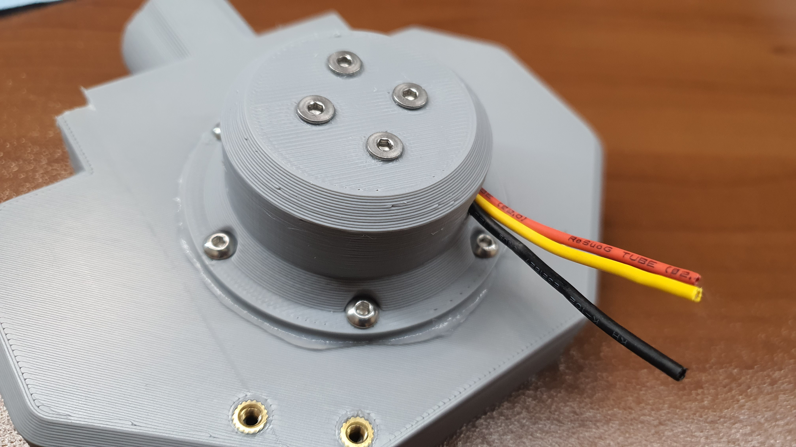
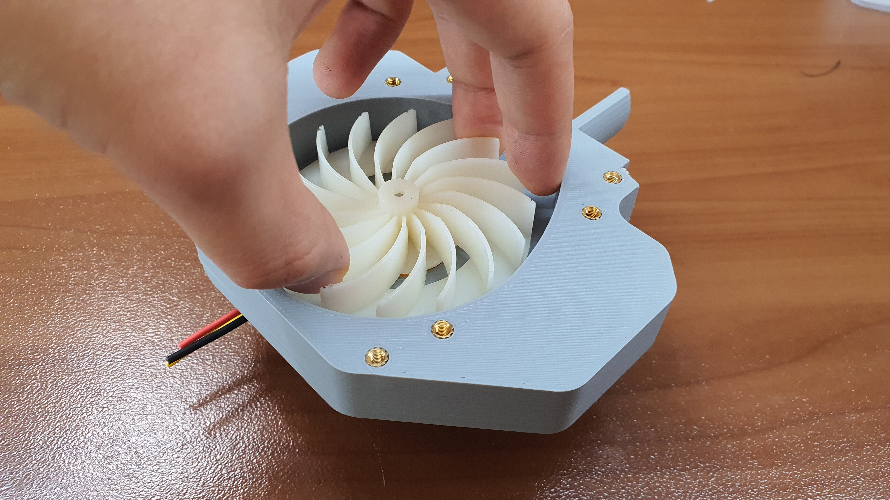
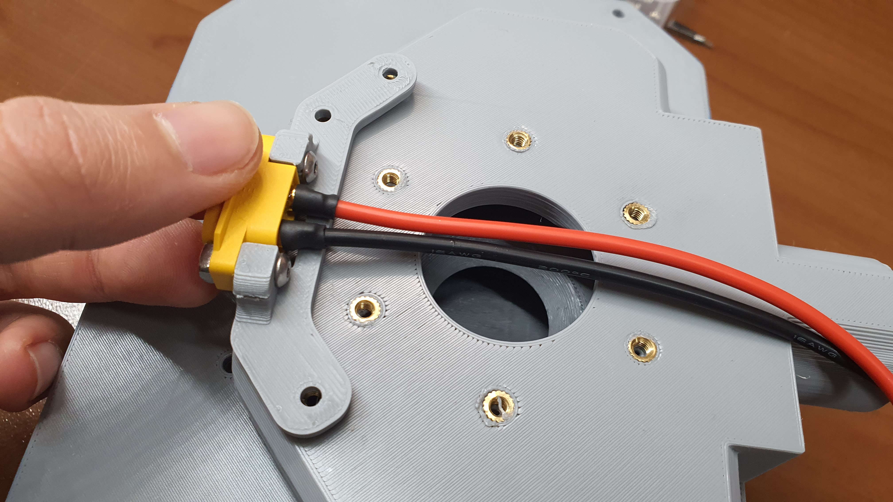
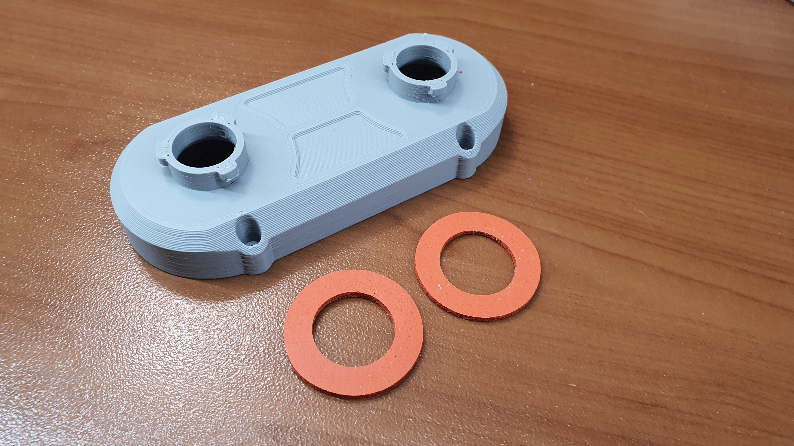
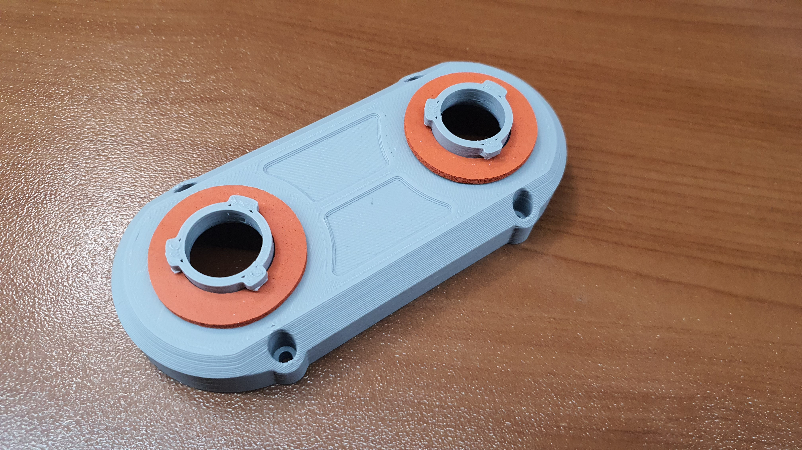
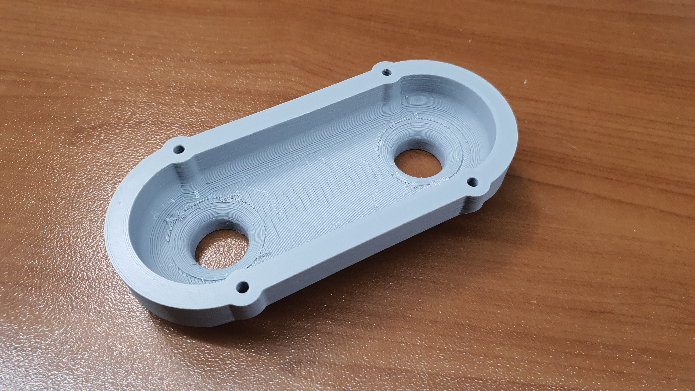
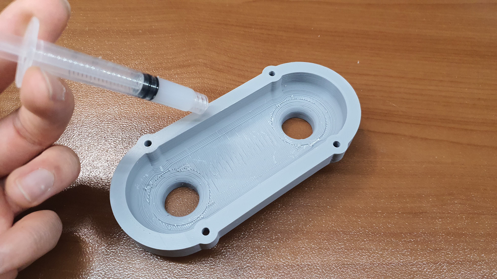
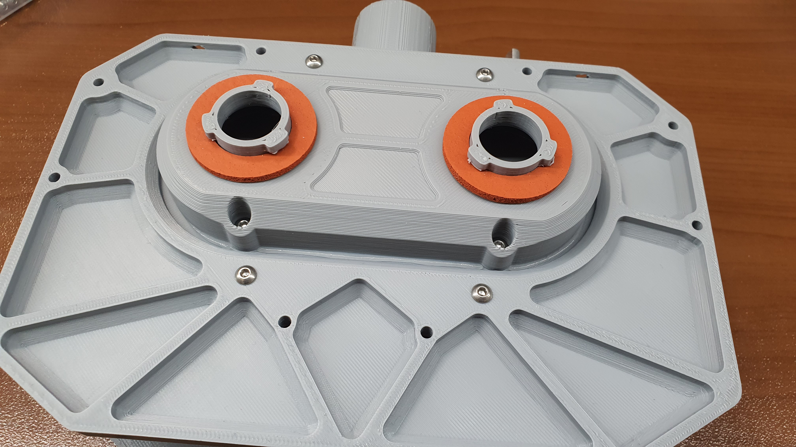
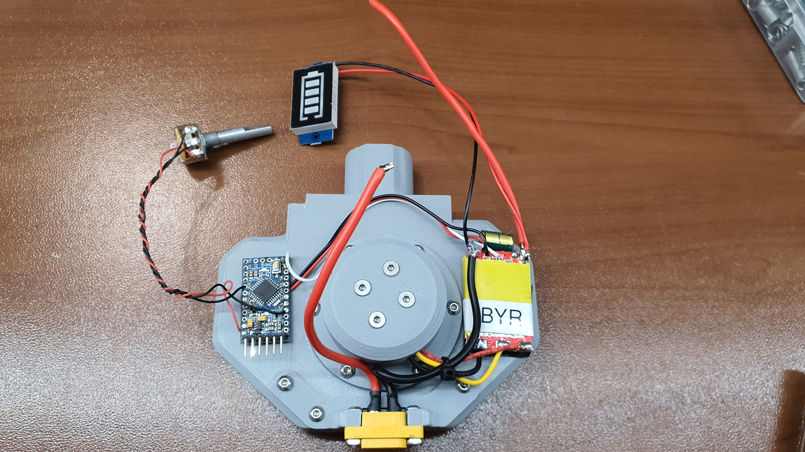

# Blower Module Assembly Manual

### Blower Module Assembly

<figure><figcaption></figcaption></figure>

## Parts

### Printed Parts List

| Parts             | Quantity | Link |
| ----------------- | -------- | ---- |
| Filter Cover      | 1x       |      |
| Center Frame      | 1x       |      |
| Back Cover        | 1x       |      |
| Dual Filter Mount | 1x       |      |
| Motor Mount       | 1x       |      |
| Fan Blade         | 1x       |      |
| Fan Enclosure     | 1x       |      |
| XT-60 Mount       | 1x       |      |
| Tube Mount Base   | 1x       |      |
| Pot Dial          | 1x       |      |

### Electronic Parts List

| Parts                                    | Quantity    | Link |
| ---------------------------------------- | ----------- | ---- |
| Arduino Nano (Micro is also okay)        | 1x          |      |
| Generic 30 amp ESC                       | 1x          |      |
| Generic 2212 drone motor (900 or 1000kv) | 1x          |      |
| 10K Potentiometer                        | 1x          |      |
| 16 Guage Silicone Wire                   | 1 Meter     |      |
| General Purpose Wire                     | 2 Meter     |      |
| Servo Wire                               | 0.25 Meters |      |
| 3s Battery Level Meter                   | 1x          |      |

### Miscellaneous Parts List

| Parts                                       | Quantity  | Link |
| ------------------------------------------- | --------- | ---- |
| Electronic (or food grade) Silicone Sealant | 1x tube   |      |
| 3M Respirator Replacement Gasket            | 2x        |      |
| 1-1/4" Vacuum Hose                          | 1.5 Meter |      |
| M3x3 Threaded Insert                        |           |      |
| M3x6 Threaded Insert                        |           |      |
| M3x7 Tampered Head Screw                    | 4x        |      |

### Step 1

<figure><figcaption></figcaption></figure>

Grab the fan enclosure and heat set nine m3x3 threaded inserts into the holes highlighted above.

### Step 2

<figure><figcaption></figcaption></figure>

 

<figure><figcaption></figcaption></figure>

Now face the component upward and heat set two m3x6 threaded inserts into the holes highlighted above. Then repeat the process on the forward part of the component into the eight highlighted holes.

### Step 3

<figure><figcaption></figcaption></figure>

 

<figure><figcaption></figcaption></figure>

Now it's time to move on to the motor assembly. Grab the motor mount, the motor, and four tampered M3x7 screws. Fish the motor power lines out the hole on the sidewall of the motor mount.


In the photo, you can see we trimmed the bullet connectors that come with the motor so it can be directly soldered onto the ESC. This is not required but recommended. It will make it easier to push the motor lines through the motor mount hole.


### Step 4

<figure><figcaption></figcaption></figure>

 

<figure><figcaption></figcaption></figure>

Align the four motor mounting points with the screw holes on the motor mount. Fill the holes with silicone sealant before screwing in the m3x7 tampered head screws.

### Step 5

<figure><figcaption></figcaption></figure>

Seal the motor wire hole with silicone sealant.&#x20;


Be careful not to have sealant drip onto the motor itself!


### Step 6

<figure><figcaption></figcaption></figure>

 

<figure><figcaption></figcaption></figure>

Apply a generous amount of silicone sealant around the mounting ring of the motor mount.&#x20;

### Step 7

<figure><figcaption></figcaption></figure>

Align the motor mounting ring to the six brass threaded inserts on the backside of the fan enclosure.&#x20;

### Step 8

<figure><figcaption></figcaption></figure>

Screw in six M3x6 mm screws to retain the motor mount. It is optimal to have some silicone bleed out the edge in a relatively uniform manner to guarantee an air-tight seal.&#x20;

### Step 9

<figure><figcaption></figcaption></figure>

Turn the fan enclosure towards the front and push in the fan blades into the motor shaft.


If the fit is tight, use a rubber mallet and tap very lightly. If the fit is loose, use a dab of epoxy on the motor shaft.&#x20;


### Step 10

<figure><figcaption></figcaption></figure>

 

<figure><figcaption></figcaption></figure>

Grab the XT-60 mount and the panel mount XT-60 connector. Align the connector ensuring the positive side of the XT-60 connector is facing the side of the mount with 2 holes. Use two m3x12mm screws from the backside and fasten the XT-60 connector with 2 square nuts. Fasten the XT-60 mount assembly with three m3x6 mm screws.


Most XT-60 Panel mounts have a stainless steel hex nut inside the connector, this should be removed. It can be pushed out with a screw driver or allen key.&#x20;


### Step&#x20;

<figure><figcaption></figcaption></figure>

 

<figure><figcaption></figcaption></figure>

Now it's time to grab the dual filter mount and two 3M respirator gaskets. Gently insert the gaskets onto the 2 filter mounts.

### Step&#x20;

<figure><figcaption></figcaption></figure>

 

<figure><figcaption></figcaption></figure>

Flip the dual filter mount inside out, and apply a generous bead of silicone around the inner perimeter.&#x20;


Make sure the silicone bead is aligned to the inner edge not the outer, that way we can ensure a proper seal that is not compromised by the screw holes.&#x20;


### Step&#x20;

<figure><figcaption></figcaption></figure>

 

<figure><figcaption></figcaption></figure>

Now grab the center frame. Align the dual filter mount (Ensuring the 2 upper filter lock prongs are facing up) and gently place it onto the recessed upper center mounting area of the center frame. Ensure the four screw holes are aligned.&#x20;

## Step

<figure><figcaption></figcaption></figure>

