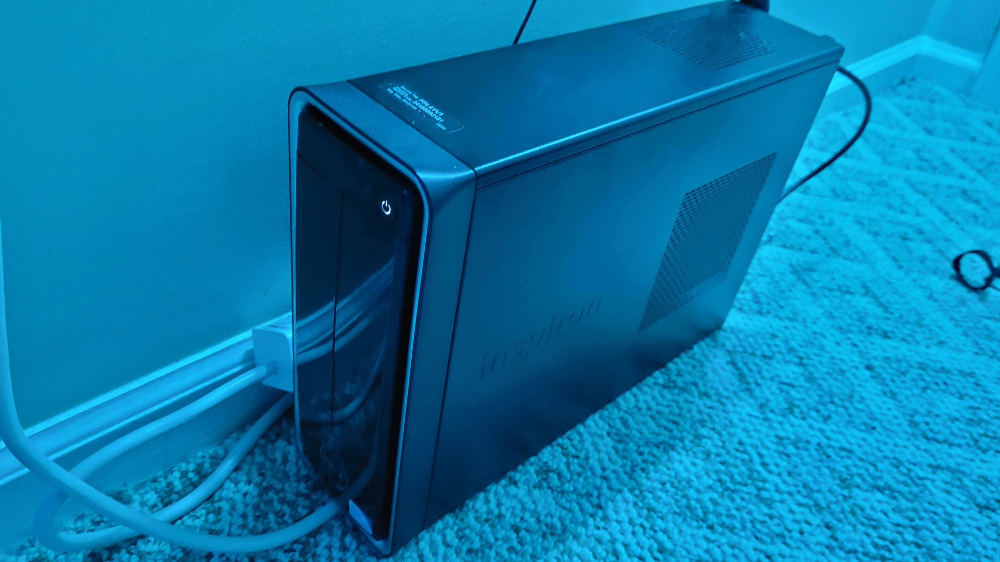
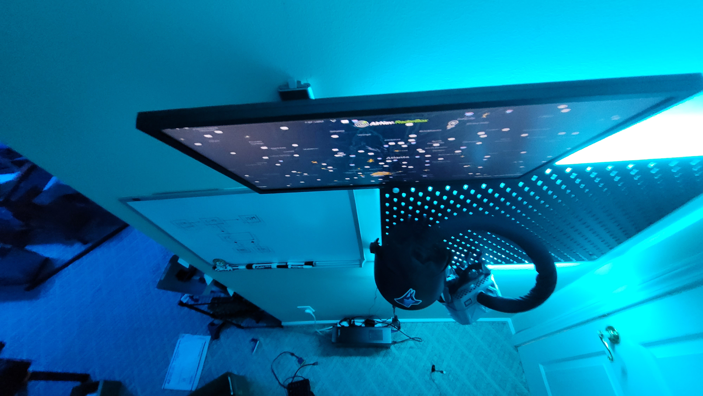

# How to Setup

## Choosing your operating system: Android x86&#x20;


Make sure you **backup any important data** from your PC before attempting to flash a new OS! The flashing process may likely lead to all your data getting wiped!


The key to setting up a dashboard on an old PC is to use a lightweight operating system. In our case, we tested Debian Linux which struggled to run even the basic ADSB application on a browser. The choice was made to flash Android x86 and run the much lighter ADSB Android app from Radarbox. The choice of the operating system will vary by what information you are looking for, so make sure to do your research and select the appropriate options.&#x20;

### &#x20;Android x86 Links





## Dashboard Application: Android App

What application to run a dashboard would vary on what information you want. Linux applications will likely require 3rd part dashboard options. Android is very convenient for this since the options to have home screen widgets can in themselves act as a simple dashboard for email notifications, weather updates, and the status of smart home devices. In our case for an ADSB dashboard, we chose the ADSB app Radarbox since we have a business account with them. From our testing, ADSB Android apps ran much better on old machines compared to the browser version of the application hence our choice of Android x86 as our lightweight OS.&#x20;

### ADSB Apps:





## Keeping the screen on

Android x86 did not allow the screen timeout to be disabled. Conveniently there are many free Android apps that will enable the screen to be left on indefinitely. In the case of Linux or other lightweight OS, we found that the option to keep the screen on all the time was easily accessible from the settings. In some Linux-based operating systems that lack this feature, a short online search will reveal simple scripts more advanced users can run for their respective OS.

## Hardware Setup

<figure><figcaption></figcaption></figure>

<figure><figcaption></figcaption></figure>

The hardware setup is very straightforward. Place the PC in the location you would like, and mount the monitor. Then, simply have power to the PC and monitor. After setting up the screen in the way you like, you can simply unplug the mouse and keyboard peripherals. If you would like the access the screen once in a while, it may be convenient to invest in a cheap Bluetooth-based keyboard touchpad combo.&#x20;
