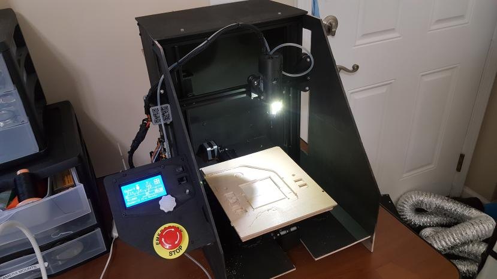
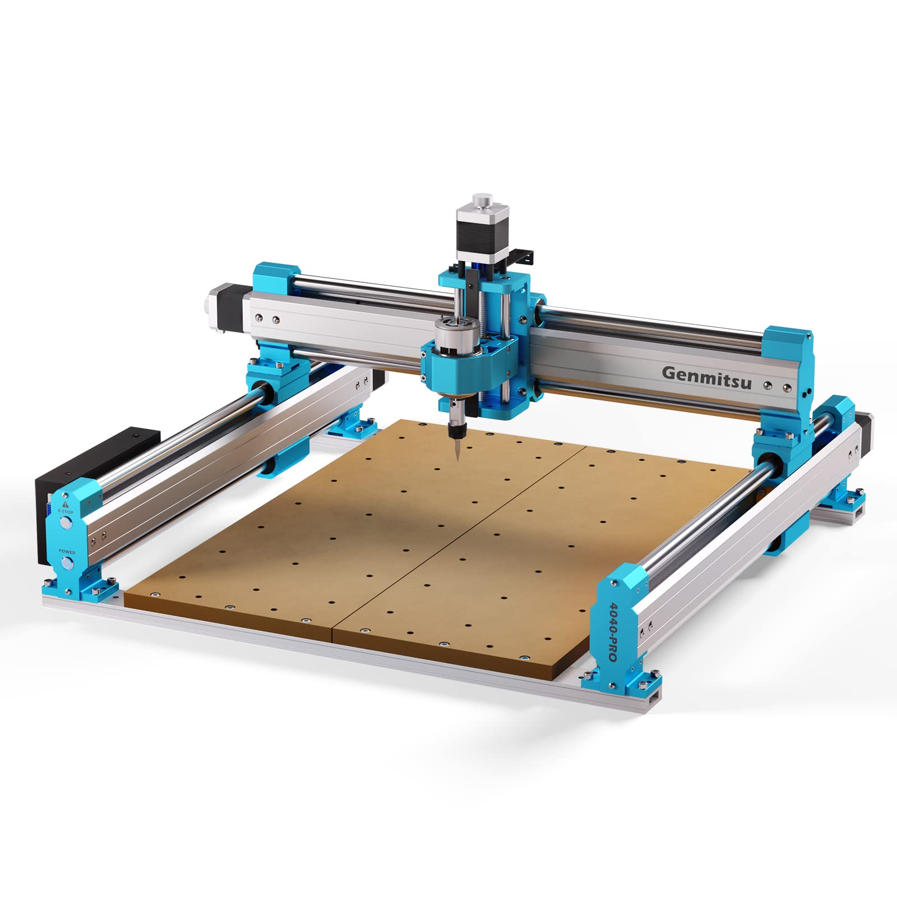

# CNC Machining

## Introduction

Computer Numerical Control Machining or CNC is a method of automated machining through computer-controlled tools (from the acronym, go figure). CNC machining is what we call Subtractive Manufacturing, where parts are cut out of larger blocks of material. This is fundamentally a wasteful and time-consuming process hence the high costs, however, it yields some of the strongest most optimized parts. The removal of material as opposed to the addition of material often allows unmatched strengths, since from the beginning the mass of material is in a uniform and stable state.&#x20;

#### When Should I Use CNC Machining?

Though CNC machining is neither the most efficient nor elegant manufacturing process, it typically yields extremely strong, consistent parts compared to other novel manufacturing processes such as 3D printing. We regularly try to avoid CNC machining due to the time and cost, but when part reliability and strength are critical to the overall goal, it's often the best manufacturing method to go with.

#### Disadvantaged of CNC Machining

Typically, budgetary and time constraints along with part geometry will be the determining factor whether CNC machining a part is feasible and practice. Much like how some part geometries simply must be designed in certain ways to be 3D printed, the same applies to CNC machined parts but with perhaps arguably even greater restrictions. Designing a part to be CNCed will involve the careful consideration of the necessary tool changes, tool paths, and tolerances the machine is capable of handling. As limiting as this may sound, applying this knowledge can only be learned through experience or by consulting with an experienced machinist.

## Safety


CNC machines can be dangerous to operate! The fast-spinning tools and powerful motors can easily cause serious injury!


CNC machines are dangerous tools that should be used carefully. Sharp tools spinning at very fast speeds along with very powerful axis motors is a recipe for fingers flying off your pretty hands. Make sure to seek the help of more experienced CNC operators before you proceed, or practice on smaller machines. This doesn't mean small desktop CNCs are safe, keep your fingers away from moving tools, and don't go beyond your comfort zone!

Dust control is very important when operating a CNC machine. CNC machines produce very fine dust and chips, which can be very harmful to breathe in. Dust from conductive materials such as carbon fiber and metals can also damage electronics. Make sure you have a vacuum and respirator handy or install a dust extraction system.&#x20;

## Software

### Fusion 360 CAM

Fusion 360 has an advanced integrated CAM (Computer Aided Manufacturing) suite, offering a smooth transition from CAD design to machining operations. Below is a video for some of the more relevant operations home CNC users may come across.



For more information on Fusion 360, check out our documentation in the page below.


[computern-aided-design.md](../../design-and-simulation/computern-aided-design.md)


### Easel

Easel is a browser-based CAM software primarily for 2D CNC operations and mild 3D contour machining. It is by far the easiest CAM software to get started in, the UI is clean and simple, and the steps are extremely straightforward. The only downside is that it offers only a 30-day free trial. However, we encourage new users to utilize this 30-day free trial to learn the basics of CNC machining before trying out other CAM programs!



### Estlcam

Estlcam is a completely free open-source CAM software specifically for milling operations. We have had a relatively good experience as new users with Estlcam, it is by far the closest CAM software to Easel. However, unlike Easel, it is not browser-based, it's completely free, and its UI is a little messier. We think Estlcam is a good CAM suite for intermediate CNC users like ourselves.&#x20;



### Open Builds CONTROL

Open Builds Control is another great open-sourced CNC milling CAM suite we have used before. The greatest advantage of Open Builds Control is probably the larger community support for both the hardware and software. This software was community-developed to complement a variety of open-sourced CNC machines. Open Builds Control has by far the cleanest UI for a free CAM software, but learning the software will take some time due to its many parameters.



### Candle (GRBL Controller)

Candle is a fully open-source CNC-controller application based on GRBL control. We mainly use Candle to run our Genmitsu 4040 PRO CNC. Candle is a relatively basic machine controller that can easily import any G-Code operations to run. We really like the simple to-the-point UI and feature sets. However the lack of features can be a limiting for more complex projects, and most of the machine settings have to be set during the G-code generation process.&#x20;


Candle is not a Gcode generator, it is only a machine control interface.&#x20;




## Hardware

### "Janky" Ender 3 CNC Conversion

<figure><figcaption></figcaption></figure>

You heard us right, our primary CNC machine is nicknamed "Janky", it's an Ender 3 converted to a CNC machine. We found this to be a cheap, low-cost way to get started in CNC machining and engraving for new users who enjoy tinkering. Note that the limitations of belts along with the low stiffness of the ender 3 frame make is a less than suboptimal CNC platform. However, it works very well on wood, carbon fiber, and even aluminum with slow settings.&#x20;

Special thanks to [Ben ](https://www.thingiverse.com/thinngimaker)[Briesemeister](https://www.thingiverse.com/thinngimaker)for writing a great guide about converting an Ender 3 to a CNC on his Thingiverse page (download the PDF guide).



### Genmitsu 4040-PRO

<figure><figcaption></figcaption></figure>

The Sain Smart Genmitsu 4040-Pro is an excellent CNC platform for general desktop use. Setup takes only around 15-20 min, and most of the tolerance critical axis assemblies are already pre-assembled. Overall it's a pretty basic CNC with an extremely solid frame. A nice touch is all the IO ports pre-built in for upgrades such as a laser with air assist, spindle upgrade, etc. The absolutely solid frame is even strong enough to support an entire router. The 4040 PRO is definitely an excellent machine for its value.&#x20;


