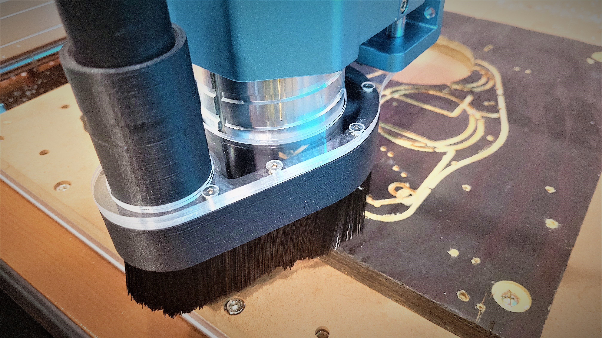
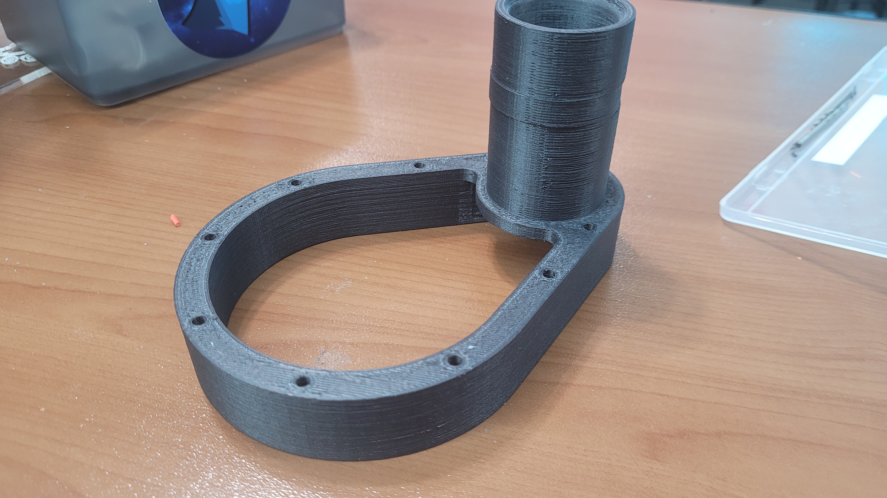
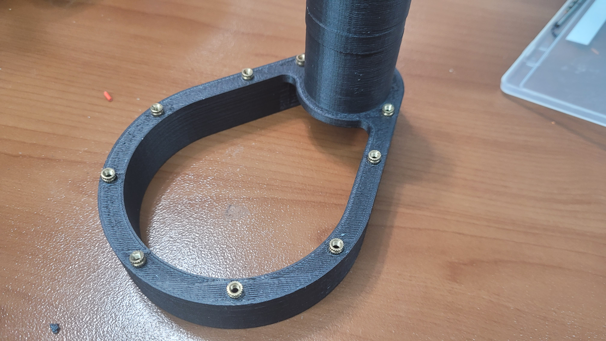
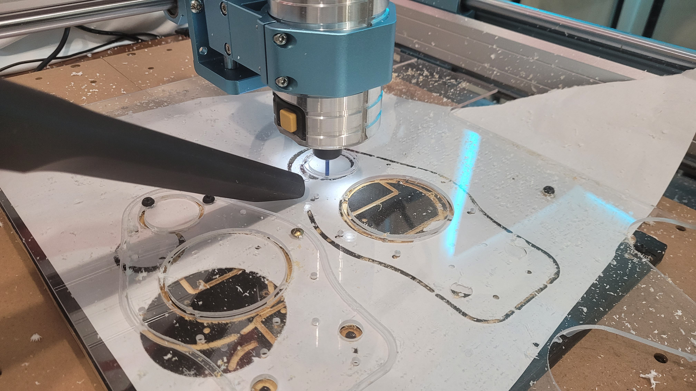
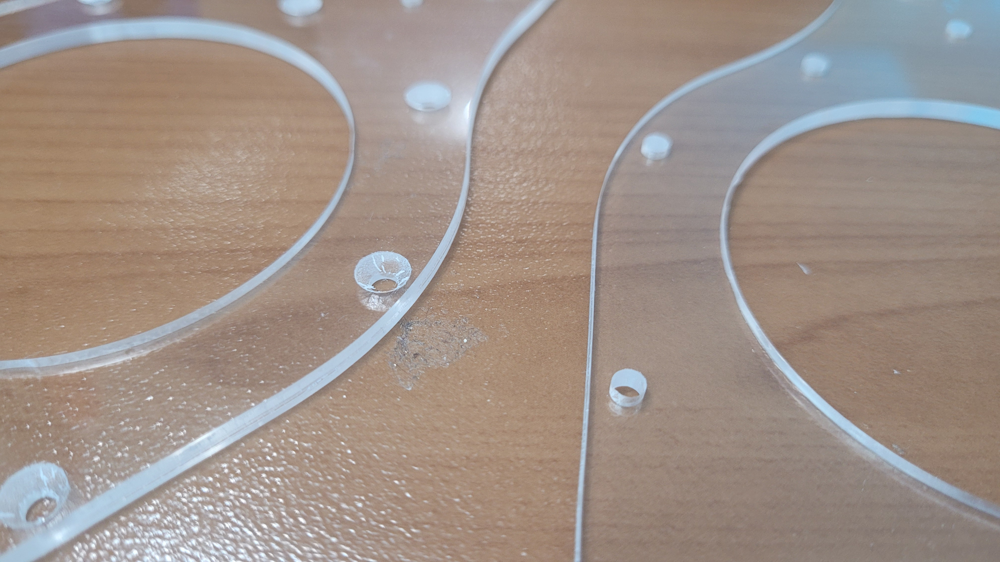
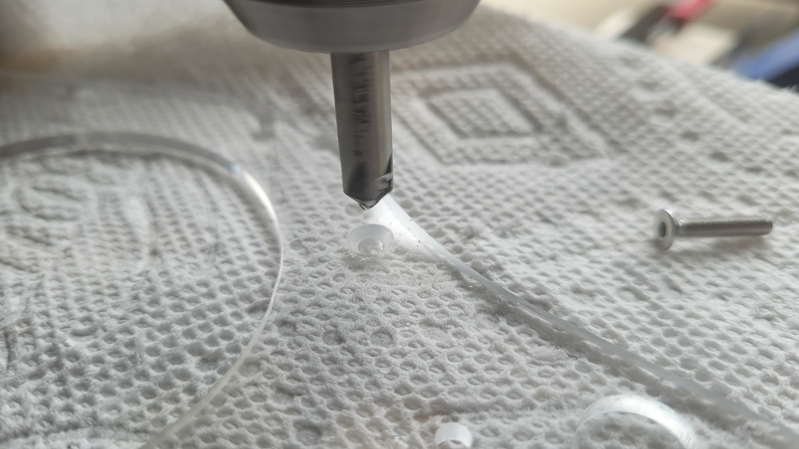
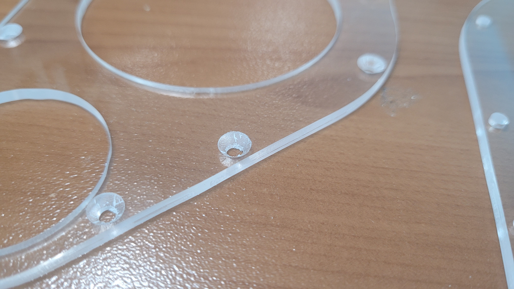
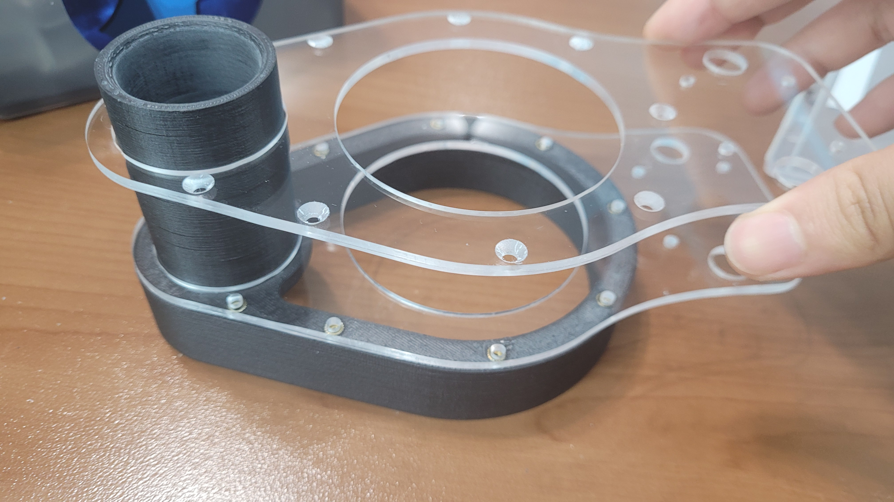
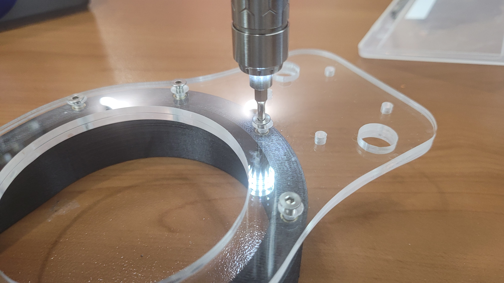

# 4040 Pro Dust Boot

<figure><figcaption></figcaption></figure>

## Parts List

| Part                        | Quantity   | Notes                                                      |
| --------------------------- | ---------- | ---------------------------------------------------------- |
| M3x10 Flat Head             | 9x         |                                                            |
| M3x18 Button Head           | 4x         |                                                            |
| M3 Washer                   | 4x         |                                                            |
| M3 Nut                      | 4x         |                                                            |
| M3x3 brass threaded inserts | 9x         |                                                            |
| Brush Strip                 | 1x         | Find on amazon, search "Brush strip".                      |
| Shop-vac & Brush Mount      | 1x         | 3D print in preferably a tough material (PA-6, ASA, etc.)  |
| Plexiglass Boot Frame       | 1x (or 2x) | CNC mill out of two 3mm plexiglass, or onr 6mm plexiglass. |

## Files



## Assembly Instruction

### Step 1

<figure><figcaption></figcaption></figure>

Remove supports on the 3D-printed vacuum brush mount.

### Step 2

<figure><figcaption></figcaption></figure>

Add the nine M3x3 brass threaded inserts into the holes on the top of the 3D printed part.

### Step 3

<figure><figcaption></figcaption></figure>

CNC mill the plexiglass frame panels from the DXF file. Use either a single 6mm plexiglass sheet, or two 3mm sheets.

### Step 4

<figure><figcaption></figcaption></figure>

 

<figure><figcaption></figcaption></figure>

A bezel needs to be cut out on the acrylic sheet part to allow the flat head screw to remain flush with the top panel. Only cut this recess to the 9 surrounding holes, not the 4 mounting holes in the back. If two 3mm sheets were cut out, make sure to only do this process on one of the two panels. We used a deburring bit on a press drill to ensure a consistent cut:

<figure><figcaption></figcaption></figure>

 

<figure><figcaption></figcaption></figure>

### Step 5

<figure><figcaption></figcaption></figure>

line up and Insert the plexiglass frame on top of the 3D-printed shroud. If you used two 3mm sheets, make a tandem stack ensuring the bezel cut sheet is on top.&#x20;

### Step 6

<figure><figcaption></figcaption></figure>

Screw in all nine M3x10 flat head screws around the shroud brass threaded inserts.

### Step 6
