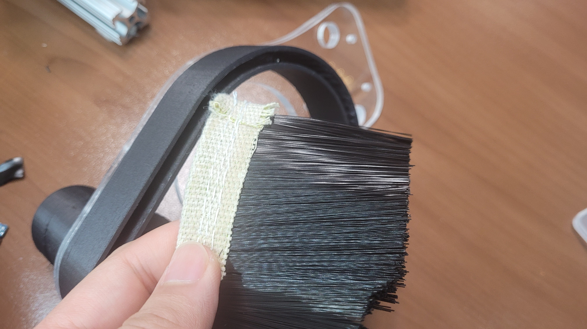
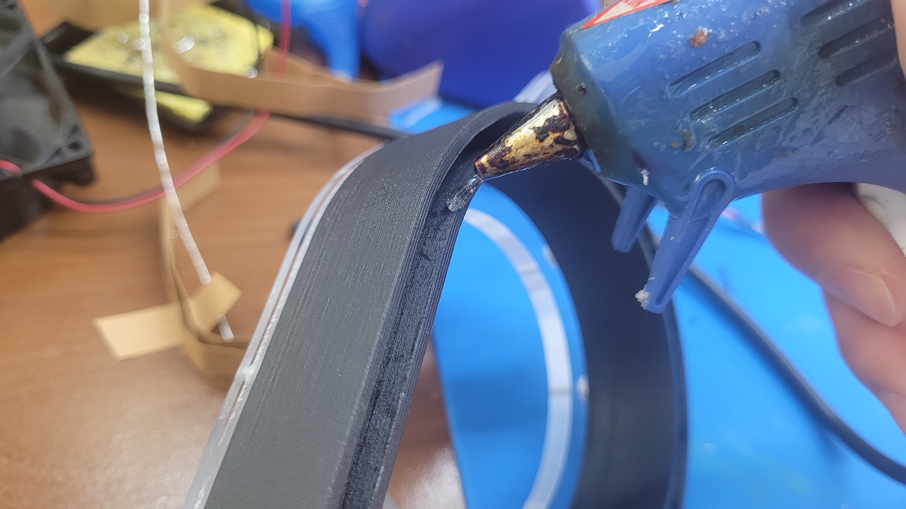
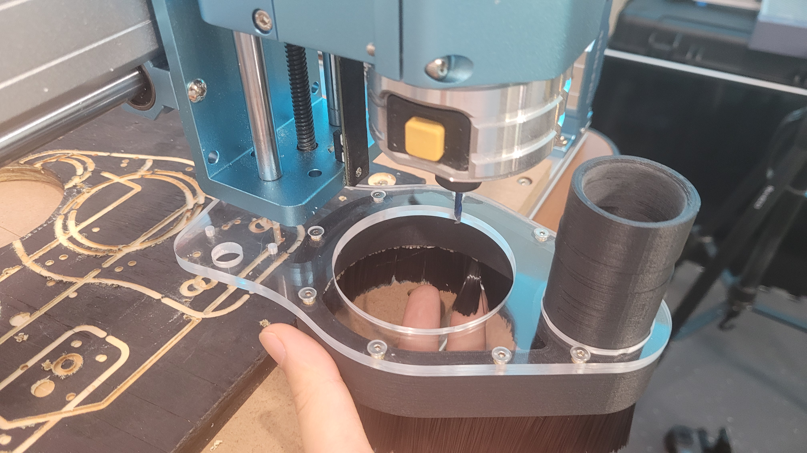
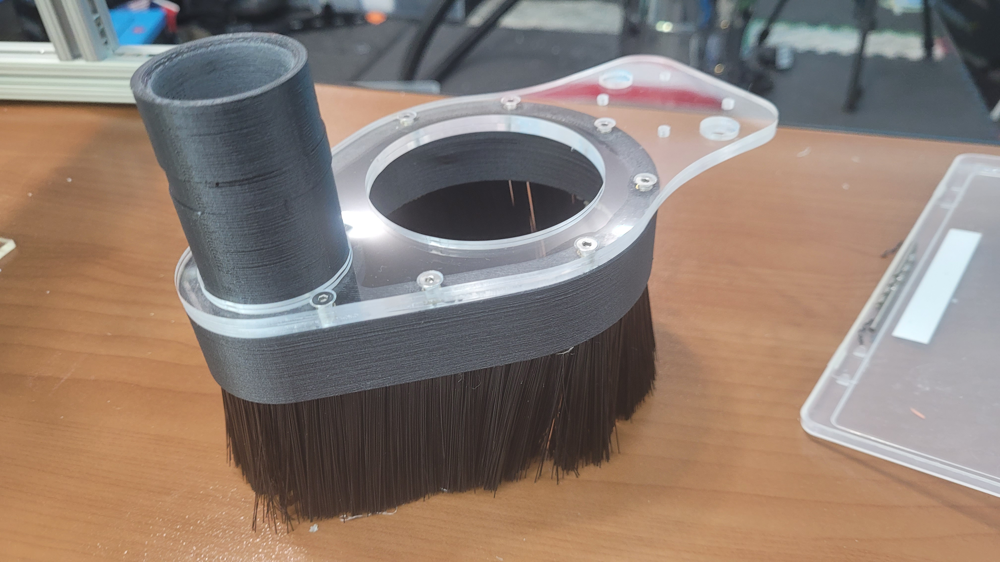
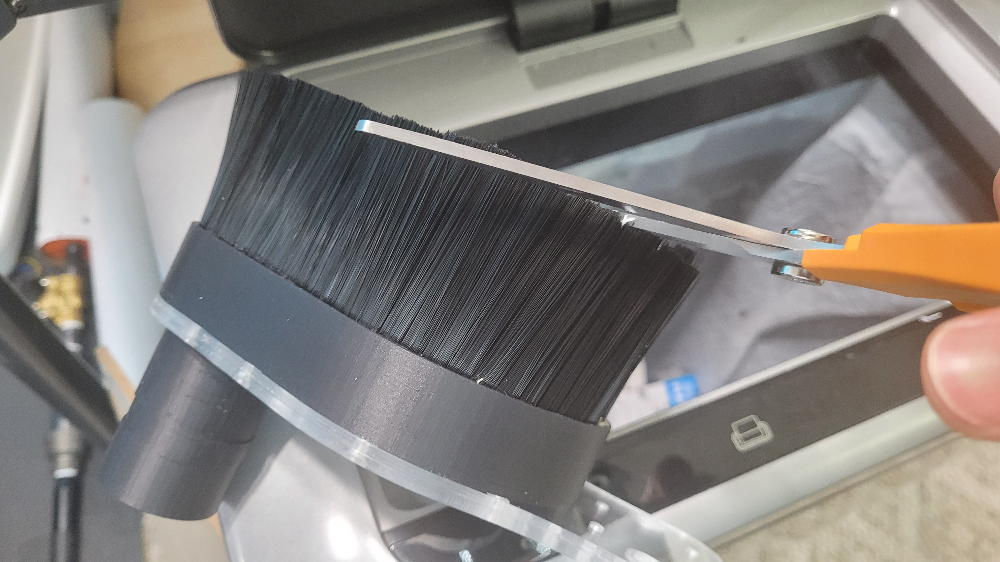
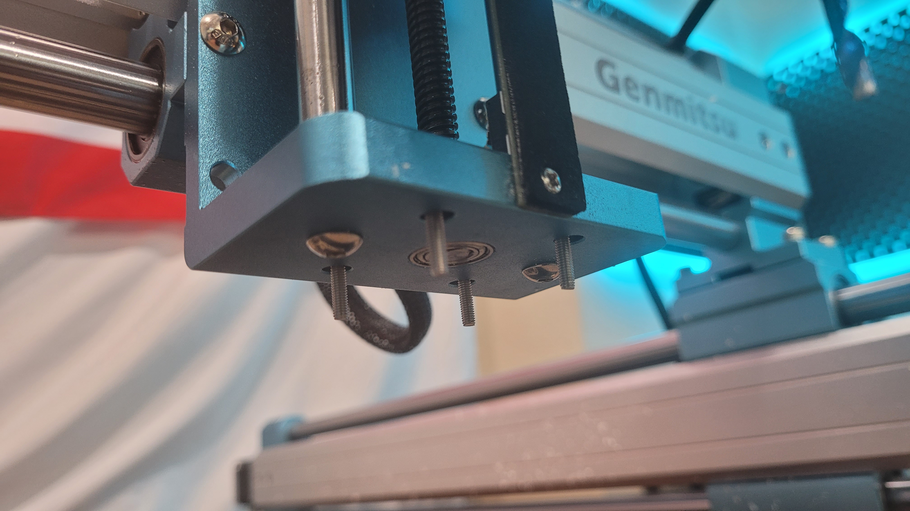
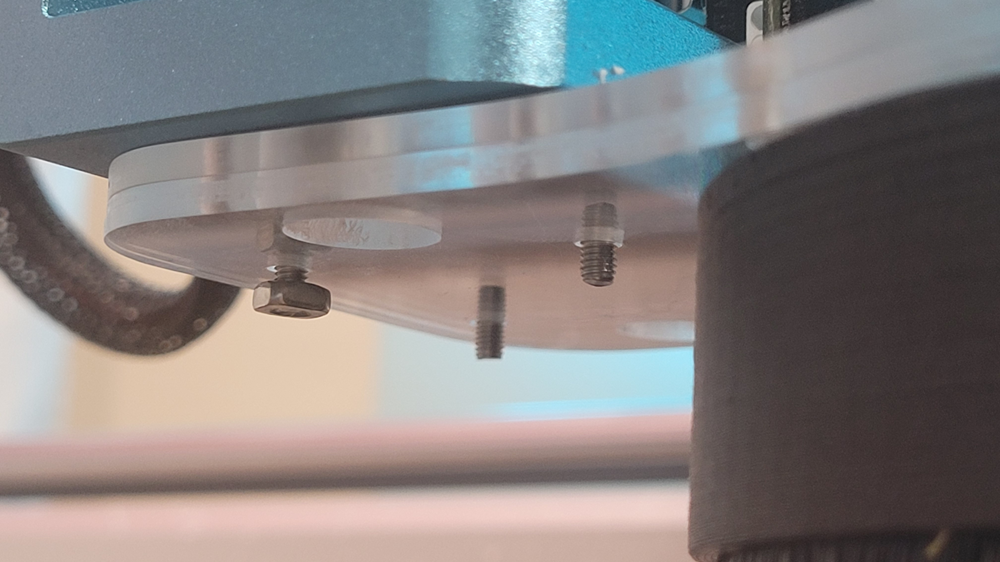
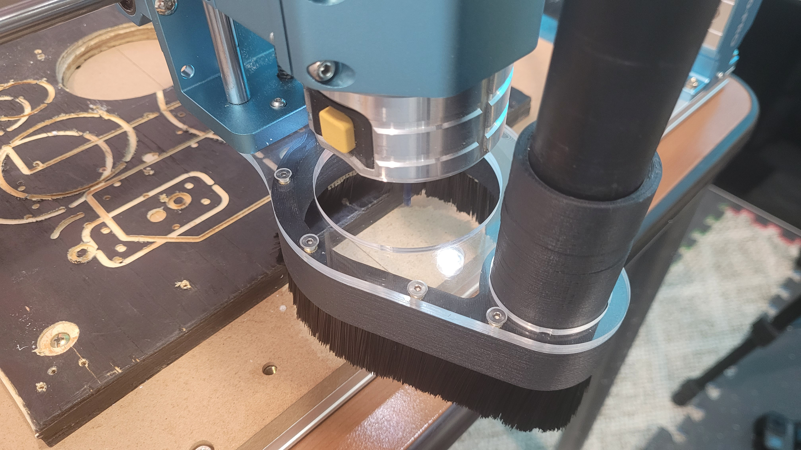

# 4040 Pro Dust Boot

<figure><figcaption></figcaption></figure>

## Parts List

| Part                        | Quantity   | Notes                                                      |
| --------------------------- | ---------- | ---------------------------------------------------------- |
| M3x10 Flat Head             | 9x         |                                                            |
| M3x18 Button Head           | 4x         |                                                            |
| M3 Washer                   | 4x         |                                                            |
| M3 Nut                      | 4x         |                                                            |
| M3x3 brass threaded inserts | 9x         |                                                            |
| Brush Strip                 | 1x         | Find on amazon, search "Brush strip".                      |
| Shop-vac & Brush Mount      | 1x         | 3D print in preferably a tough material (PA-6, ASA, etc.)  |
| Plexiglass Boot Frame       | 1x (or 2x) | CNC mill out of two 3mm plexiglass, or onr 6mm plexiglass. |

## Files



## Assembly Instruction

### Step 1

<figure><figcaption></figcaption></figure>

Remove supports on the 3D-printed vacuum brush mount.

###

### Step 2

<figure><figcaption></figcaption></figure>

Add the nine M3x3 brass threaded inserts into the holes on the top of the 3D printed part.

###

### Step 3

<figure><figcaption></figcaption></figure>

CNC mill the plexiglass frame panels from the DXF file. Use either a single 6mm plexiglass sheet, or two 3mm sheets.

###

### Step 4

<figure><figcaption></figcaption></figure>

 

<figure><figcaption></figcaption></figure>

A bezel needs to be cut out on the acrylic sheet part to allow the flat head screw to remain flush with the top panel. Only cut this recess to the 9 surrounding holes, not the 4 mounting holes in the back. If two 3mm sheets were cut out, make sure to only do this process on one of the two panels. We used a deburring bit on a press drill to ensure a consistent cut:

<figure><figcaption></figcaption></figure>

 

<figure><figcaption></figcaption></figure>

###

### Step 5

<figure><figcaption></figcaption></figure>

line up and Insert the plexiglass frame on top of the 3D-printed shroud. If you used two 3mm sheets, make a tandem stack ensuring the bezel cut sheet is on top.&#x20;

###

### Step 6

<figure><figcaption></figcaption></figure>

Screw in all nine M3x10 flat head screws around the shroud brass threaded inserts.

###

### Step 7

<figure><figcaption></figcaption></figure>

 

<figure><figcaption></figcaption></figure>

Insert the brush strip into the channel on the bottom of the 3D-printed parts. Make sure to use an adhesive of choice incrementally as you take your time to evenly squeeze in the brush strip. In our case, we used hot glue.&#x20;

###

### Step 8

<figure><figcaption></figcaption></figure>

 

<figure><figcaption></figcaption></figure>

 

<figure><figcaption></figcaption></figure>

Now align the boot against the CNC mill to check the brush length. If the brush is spreading outward, it is too long and will require trimming.


Trim incrementally! If it's too long you can always trim it. If you cut it too short, the boot will not be effective at extracting dust.&#x20;


###

### Step 9

<figure><figcaption></figcaption></figure>

Insert the four M3x18mm button head cap screws with the M3 washers on the four holes at the base of the Z-axis carriage.

###

### Step 10

<figure><figcaption></figcaption></figure>

Align the dust boot's four holes with the four screws, and gently tighten on the M3 nuts. There may be some play with the boot, ensure the router can lower into the boot without interference.

### Step 11

<figure><figcaption></figcaption></figure>

The build is complete, you can now attach the shop-vac to the vacuum connector. Make sure to check for any possible interferences before operating the CNC & dust boot.&#x20;

