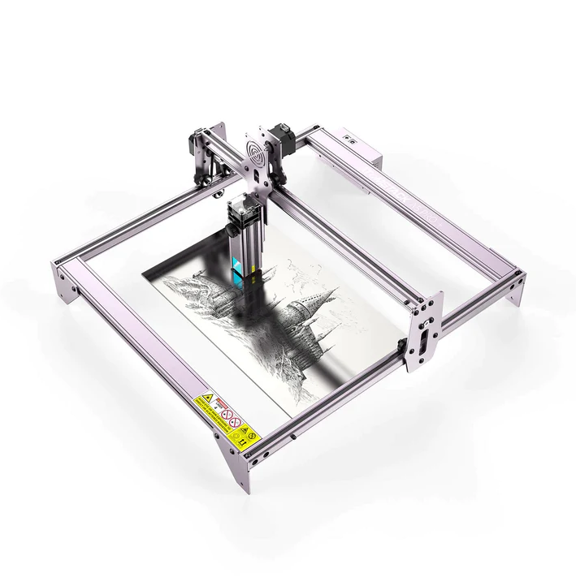

# Laser Cutting

## Introduction

In our opinion, laser cutting is an underrated manufacturing process. Laser cutters allow precision cutting on two-dimensional surfaces extremely quickly. Unlike CNCs since you are burning your way through, no bits or tooling is needed. If you have experience with a 3D printer of CNC, laser cutters are extremely easy to get started in!

#### When Should I Use a Laser Cutter?

For anything that requires cutting flat materials, laser cutters are the way to go. However, make sure you do your own research on which materials work, and which ones don't. We often utilize laser cutters often in our prototyping stage to make a rapid try in parts. It's faster and cheaper than 3D printing, and it's extremely easy to use.&#x20;

#### Disadvantages of Laser Cutters:

The biggest dealbreaker with the laser cutters in our opinion is managing the toxic fumes and the safety hazard of the laser beam. It only takes a brief accident to go completely blind if used irresponsibly, and this can be intimidating to new users. Not only that, the fumes it produces are typically toxic and require extremely adequate ventilation. Laser cutters also have two big limitations in terms of operations performance. For one, unlike CNC which can practically cut through anything, lasers have limitations on what materials they can cut, and even the color and how transparent the material is. The second limitation is the divergence of the laser beam, on thicker material a sort of cone effect on the cut is obvious from the divergence of the laser as the cut gets further away from the focal point.&#x20;

## Safety


Lasers can **PERMANENTLY BLIND YOU!** Make sure to always wear **certified** laser goggles designed for the **proper spectrum** when operating a laser, and do it in an area where no person or animal can be harmed from ANY stray laser light


Lasers are really dangerous to work with. Probably the most dangerous risk the user is under is permanent eye damage or blindness from equipment failure or improper usage. Always wear laser goggles that are **CERTIFIED** by ratings standards such as ANSI Z136.7 (Check out the manufacturers and certifier entities). **NEVER** trust cheap laser goggles, or the ones that come with your device. Certified laser glasses can cost upwards of $100-200. It may be very expensive initially, but the only absolute way to guarantee full protection from permanent eye injury.

Another factor to be well aware of is **toxic fumes** and **fires.** Make sure you have **proper ventilation** (Not a dinky fan, a full on air duct outside with a powerful inline fan) and are well versed on what material you're cutting! Some materials like vinyl will produce acidic smoke that will destroy your machine. Other materials can release things like cyanide gas! Make sure you are aware of the flammability of your material and use the appropriate laser power settings, and have a fire extinguisher nearby. Never operate a laser unattended!&#x20;

## Software

### Laser GRBL

Laser GRBL is a very easy-to-use open-source laser cutter control software. What we like about laser GRBL is how straight to the point the UI is. It's basically setting up the speed and power with basic controls. If your intentions is to do basic laser tasks, Laser GRBL will be more than enough to satisfy your needs.&#x20;



## Laser Cutters And Engravers


A Note on Open Frame Laser Cutters/Engravers: Open Frame laser cutters/engravers are sold at a much lower cost because there is no enclosure. This is VERY dangerous, they should NEVER be used as advertised. A proper enclosure that can protect the user from the harmful laser radiation and exhaust the toxic fumes properly is necessary before use!


### Atomstack A5 Laser Engraver

<figure><figcaption></figcaption></figure>

We found the atomstack as a good balance between price and performance, however as warned above it is an open frame laser engraver and should be used with extreme caution! The engraver is capable of cutting through thin plywood, fabric, paper, cardboard, and dark acrylic, however it is relatively slow due to the low power output of the diode laser. However, as an engraver, it's more than capable. The price of the machine is tempting, but unless you're well aware of the dangers of open diode lasers, it's frankly incredibly dangerous to use.


