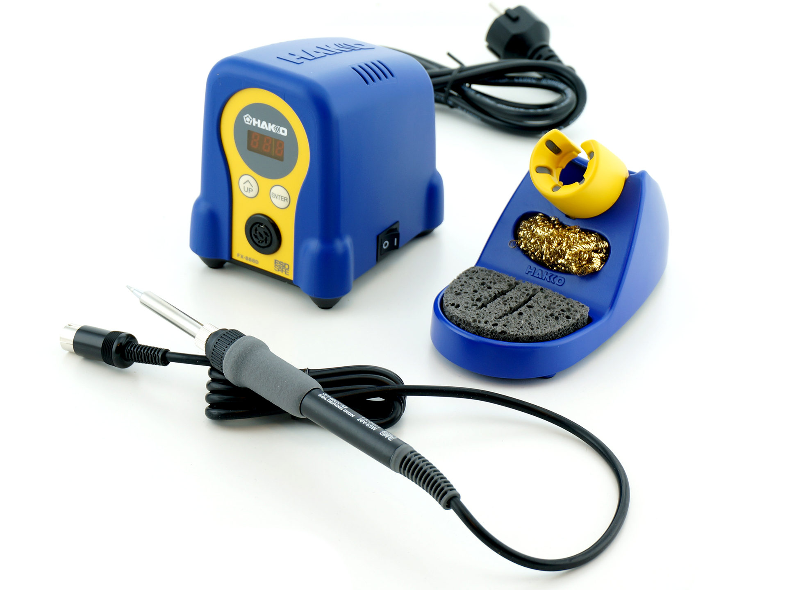

# Electronics Basics 1

## Introduction

Electronics is what brings many projects alive, quite literally. Since this is such a diverse area, we will break it down into the context of tools and skills relevant to common small projects the majority of makers will encounter. Yes, high amperage vehicle power systems, high voltage AC, and microcontrollers, we've done it all but. Remember messing with electronics can be dangerous, start small and do your research.

#### Where Do I Learn Electronics?

Electronics is probably the broadest category here. Where you learn is really dependent on what type of projects you're interested in. But in the end, nowadays the internet is probably the primary source for learning anything about electronics, perhaps with even more information than what could be sourced from an electrical engineering degree. Overall these are the different fields of electronics:

* Digital Electronics
* Analog electronics
* Microelectronics
* Circuit design
* Integrated circuits
* Power Electronics
* Optoelectronics
* Semiconductor devices
* Embedded systems
* Audio electronics
* Telecommunications
* Nanoelectronics
* Bioelectronics

_(If you would like to read the full list, check out the source:_ [_https://en.wikipedia.org/wiki/Outline\_of\_electronics_](https://en.wikipedia.org/wiki/Outline\_of\_electronics)_)_

As you can see, it's quite overwhelming. But in the grand scheme of things, all of them follow the same basic principles, principles that can be learned with many inexpensive kits and free videos online. After learning this, it's a matter of finding what category you want to focus on and become proficient in.&#x20;

Both this wiki, and the projects we work on internally will for the most part focus on Embedded Systems; the act of taking designed microelectronic, integrated circuits, and breakout components and integrating them together. Unless you're willing to invest the majority of your time into one or more of the fields listed above, the majority of hobbyists probably won't go beyond this either. If you wanted to learn about embedded systems, there are thankfully many great open-source ecosystems with massive communities. These ecosystems are examples like Raspberry Pi, Arduino, etc. All these ecosystems compromise a primary control board, or essentially the brain, and a variety of components that can communicate with it. There are literally thousands of great resources available online, and many great kits. In the end, it boils down to you pinpointing what you want to do, and putting in the time to research it.&#x20;

## Safety


Know your limits, and do not go beyond that with electronics!


#### Heat & Fire

You're probably going to handle soldering irons and heat guns as you get into electronics. Both are tools capable of starting a fire and should be handled cautiously. One of the big mistakes witnessed around these tools is how they're placed on plastic or woodwork surfaces. The best protective measure to take is always to use these tools only above a silicone or otherwise fireproof work surface. Another precaution to take is always to unplug the device when not in use (Unless you have a fancy soldering station with a nice switch).&#x20;

#### Electrical Shocks

In small electronics, small shocks are not a very big problem. However, as projects get bigger, high-voltage capacitors, power supplies, and components can literally KILL you. Make sure you do your research, and never push yourself beyond your comfort zone. One of the best ways to get into high-voltage electronics is to take guidance from someone who is already experienced. Dealing with High Voltage or High Current devices can kill or injure you. Ensure you seek guidance from a qualified individual and utilize proper safety equipment and measures!

#### Toxic Fumes

Contrary to popular belief, solder fumes are not lead fumes. They are however chemical fumes from the infused flux and other additives that are VERY bad for you. This means lead-free solder is just as hazardous as lead-filled solder, and some argue more. Venting out the fumes or running it through an air filtration system **designed to filter out solder fumes** ( NOT air purifiers or uncertified knockoffs) is a MUST to prevent respiratory damage and cancer.&#x20;

#### Lead Poisoning

Solder contains lead, and we all know what happened to people during the days of lead pipes 🙃! Often around electronic solder workstations, you will notice a lot of lead particulates that splash off your workpiece building up on surfaces around you. We recommend having something such as a shop vacuum to clean up these particulates frequently. Do not have food or drinks near your electronic workstations (I'm talking about you EEs who drink coffee while soldering) and wash your hands thoroughly after handling electronics and soldering. &#x20;

## Soldering Tools


**The general rule of thumb:** Don't cheap out on soldering tools, many of the cheaper options out on the market are fire hazards


### Hakko FX888D Soldering Station

<figure><figcaption></figcaption></figure>

The Hakko FX888D soldering station is the best soldering iron we have ever used. It may be a little bit more expensive than many options out on the market, but it's worth it! We highly recommend the Hakko soldering station to both new and expeienced users alike. We really don't recocmedn cheaper solderign station&#x20;
