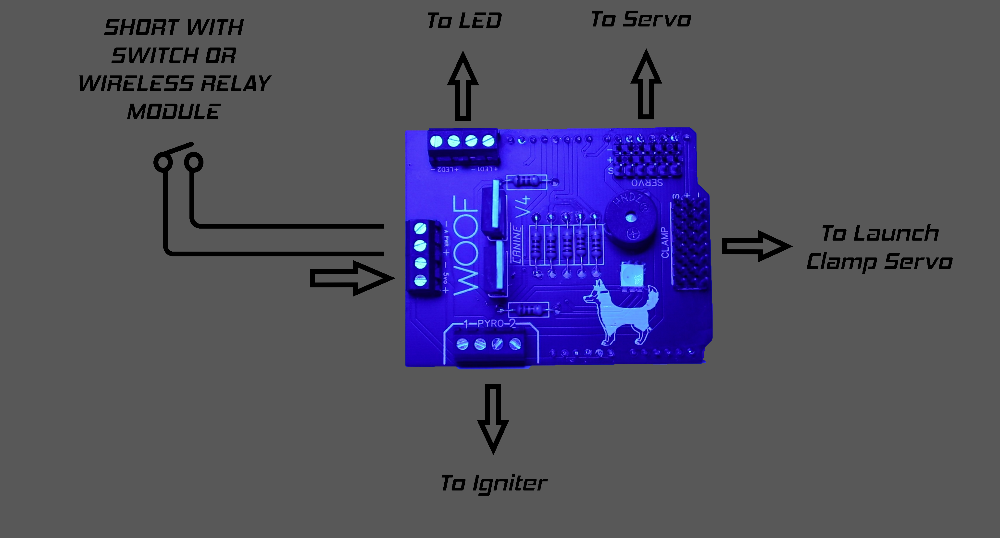

# Assembly Instructions

## Instructional Video



## Parts

| Parts                                            | Quantity  |                                                                                                                                                                                                      |
| ------------------------------------------------ | --------- | ---------------------------------------------------------------------------------------------------------------------------------------------------------------------------------------------------- |
| WOOF PCB                                         | 1x        | (Gerber File Below)                                                                                                                                                                                  |
| 100 Ohm Resistor                                 | 7x        |                                                                                                                                                                                                      |
| MHP5050RGBDT (SMD RGB LED)                       | 1x        | [https://www.lcsc.com/product-detail/Light-Emitting-Diodes-LED\_MEIHUA-MHP5050RGBDT\_C409780.html](https://www.lcsc.com/product-detail/Light-Emitting-Diodes-LED\_MEIHUA-MHP5050RGBDT\_C409780.html) |
| DB125-3.81-2P-BK-S (Through Hole Terminal Block) | 6x        | [https://www.lcsc.com/product-detail/Screw-terminal\_DIBO-DB125-3-81-2P-BK-S\_C430618.html](https://www.lcsc.com/product-detail/Screw-terminal\_DIBO-DB125-3-81-2P-BK-S\_C430618.html)               |
| TMB12A05 (5 Volt Buzzer)                         | 1x        | [https://www.lcsc.com/product-detail/Buzzers\_YUEXIN-TMB12A05\_C781860.html](https://www.lcsc.com/product-detail/Buzzers\_YUEXIN-TMB12A05\_C781860.html)                                             |
| IRF 530 Mosfet                                   | 2x        | [https://www.lcsc.com/product-detail/MOSFETs\_Infineon-Technologies-IRF530NPBF\_C2565.html](https://www.lcsc.com/product-detail/MOSFETs\_Infineon-Technologies-IRF530NPBF\_C2565.html)               |
| Header Pins                                      | 4x        |                                                                                                                                                                                                      |

## Gerber Files



## Launchpad Schematic

<figure><figcaption></figcaption></figure>


WOOF is designed to operate a programmed loop. The loop is only initiated by shorting the switch terminals with a switch or relay module. This is to ensure maximum saftey!

