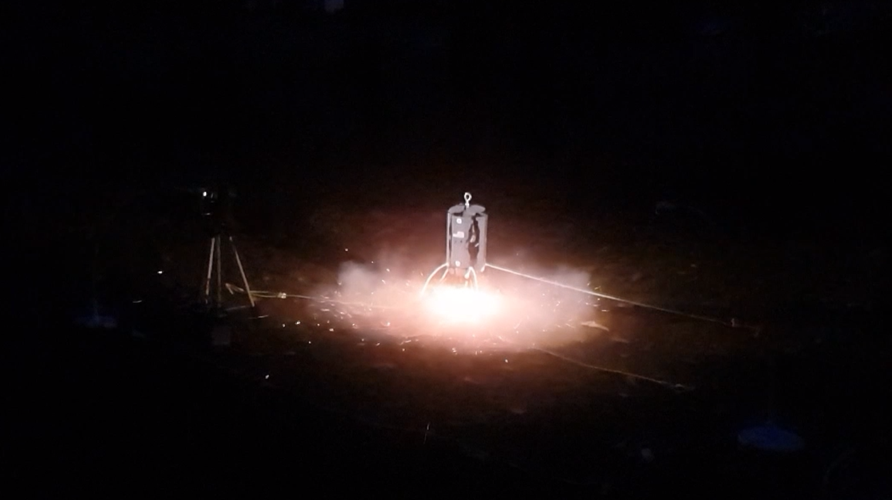

# K-9 TVC Hopper 1



K-9 TVC Hopper is our experimental modular TVC control system testbed vehicle. The hopper's highly modular design allows it to adopt many different control and propulsion systems without a large number of modifications. This platform was highly instrumental in rapidly advancing both our model rocket and drone hardware development.&#x20;

## Testflight

<figure><figcaption></figcaption></figure>

## Stats

**Status:** Experimental/Dormant

**Dev Time Period:** Jun 2019 - Oct 2019

**Type:** Model Rocket control system testbed platform

**Architecture:** K-9 Rocket Ecosystem

**Associated Project(s):** K-9 TVC V8

**Weight:** 260 grams

**Dimensions:** 250 x 250 x 300 mm

## Links & Files


