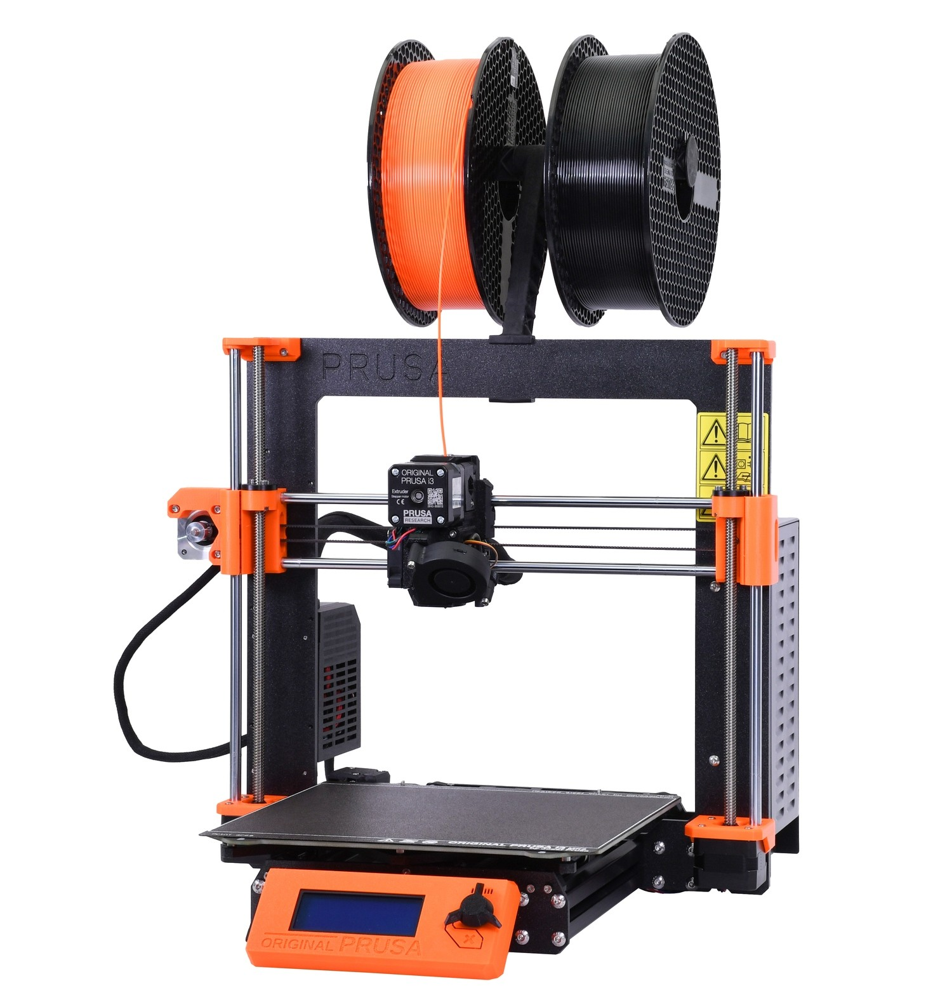
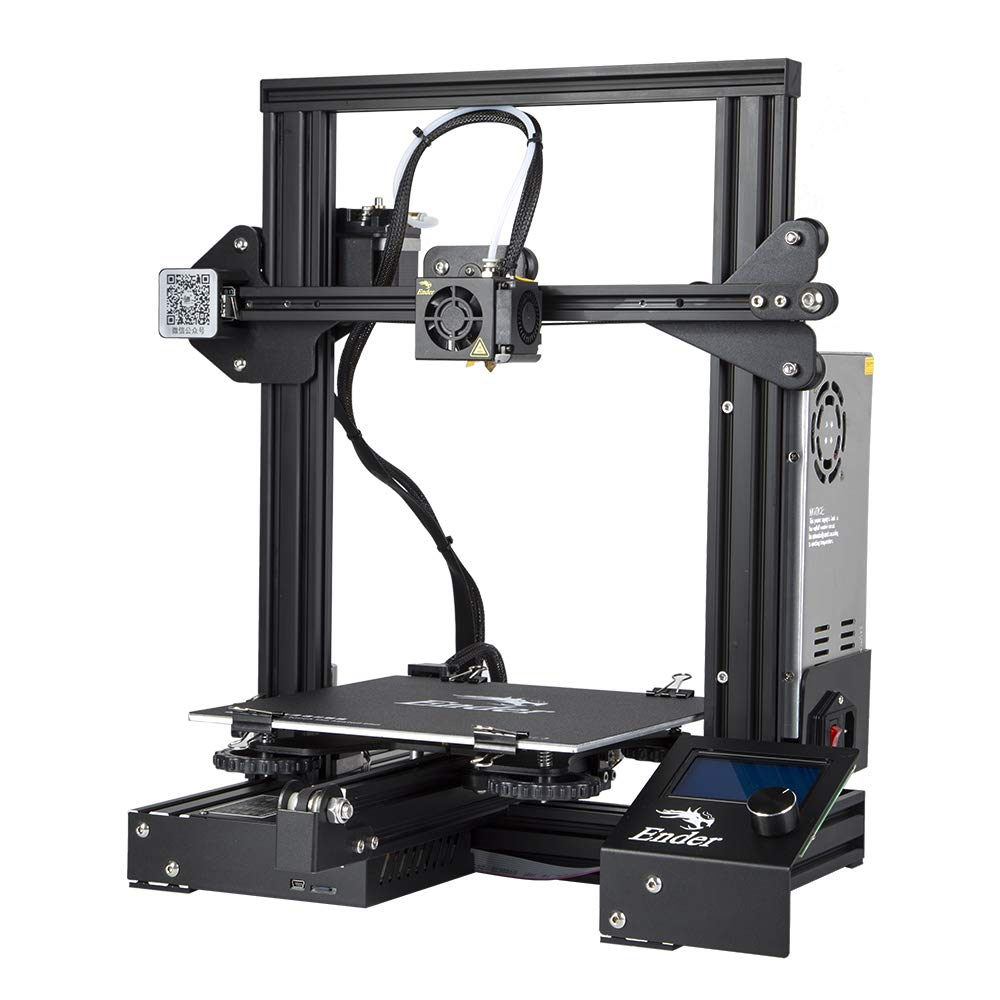

# 3D Printing

## Introduction

3D printing is probably our most utilized fabrication method in the lab. 3D printing is an additive manufacturing method that allows us to export models straight out of CAD and have usable end-use prototypes and parts. Most people visiting this wiki are probably already familiar with 3D printing, but we'll provide an overview nonetheless. The basic concept of 3D printing is layer-by-layer manufacturing of parts, whether its physically melting plastic filaments and laying it down precisely layer by layer (FDM or Fused Deposit Molding), or curing liquid resin layer by layer with a UV light source (SLA or Stereolithography). There are other methods such as sintering a polymer or metal powder layer by layer (SLS or Selective Laser Sintering), but that's not something available to consumers at a practical level just yet.&#x20;

#### When Should You Use 3D Printing?

Because of how easy it is to 3D print something, often mistakes made by many makers are 3D printing EVERY part of their project. This can often compromise both creativity and capabilities for the end product. Remember there are many other manufacturing methods, and they should all be considered before proceeding with simply printing the part. As an example we found ourselves printing a lot of flat stencils in the lab, only to realize these stencils could have been laser cut out of waste cardboard at a much cheaper cost and at much faster speeds (A few minutes as opposed to a few seconds). Always look into alternatives before becoming dependent on the 3D printer!

After consideration of the alternatives, the question of when to use 3D printing is simply a question of how&#x20;

#### Disadvantages of 3D Printing.

3D printing was supposed to be like the new steam engine, the tech that would kick off the 2nd industrial revolution, but the only factor holding it back from winning that title is speed. Although that's changing as 3D printing technology is only getting faster, it still is a rather slow process. At its current practical form, it remains impractical beyond low-volume productions (Exceptions apply). 3D printing is also very limited in what material can be printed. At the hobbyist level, you are limited to mostly resins or plastics with limited performance in temperature resistance and mechanical properties. Consequently, layer-by-layer manufacturing leads to non-isotropic (In layman's terms, non-consistent mechanical strength throughout all axises) parts. They often tend to crack along the layer lines when under stress, and this needs to be carefully accounted for during the design of the 3D-printed part. Of course, there are exceptions, SLS or MJF printing technology has allowed parts to be a shocking 95% isotropic, but these technologies aren't available at any practical level to the consumer just yet.&#x20;

#### Choosing a 3D printer.

3D printers all accomplish the same goal, but the overall options available are extremely broad. In general sticking to tried and true brands rather than companies selling niche printers with exotic features is a much better bet. But at the end of the day, it comes down to what your looking for, what applications your planning on using your machine, how often you will print, and your budget. Make sure you do your research, and if you can consult with people who are more experienced with 3D printers.&#x20;

Here are some great 3D printer reviewers to help with your research!







## Safety


Improper setup of 3D printers can lead to fires, exposure to electrical shock, and bodily injury!



3D Printing can cause long-term health issues. Make sure you exhaust fumes properly and utilize proper PPE when in contact with resins and composite filaments!


#### FDM

FDM 3D printers are a common sighting however, the principle operation of FDM printers involves melting plastic, which in turn requires heating elements and high current power supplies. Both of these parts are the usual culprit of 3D printer fires. Ensure they are set up correctly, check the wiring and look for signs of wear, and make sure the printer is not in an environment where it could overheat. Another health risk to be aware of is fumes emitted during the printing process. It is well-known materials like ABS produce toxic fumes that need to be vented out, but many do not exercise the same amount of caution with more benign materials such as PLA. The fact is, yes PLA isn't inherently toxic nor will produce toxic fumes at the temperature we normally print it, but the color pigments and other additives are. It's highly recommended to flush the air in the room the printers are located. Some studied also suggest long-term respiratory problems from plastic particulates that may be airborne. A  general rule of thumb is, don't put the printer right next to where you work for long periods of time.&#x20;

#### SLA

SLA 3D printing involves the use of toxic resins. These resins can cause skin irritation and future health complications. Make sure you **always use the proper PPE and safety equipment**: Gloves, Respirators, and an air Filtration system. If you have access to a window, you can also vent the fumes outside.&#x20;

## Software

### Prusa Slicer

Prusa Slicer is by far our favorite Slicer Software. Despite its branding, we found Prusa Slicer integrating with other printer ecosystems very effectively. One of the key features that makes Prusa Slicer great for new users is the ability to set three different modes: Simple, Advanced, and Expert. This allows users to mask the UI to their comfort level and prevent users from being overwhelmed with long lists of jargon and features. One of our favorite things about Prusa Slicer is the huge library of print settings catered for our Prusa i3 already tested by Prusa. Of c


For new users, we would highly recommend Prusa Slicer




## Printers

### Prusa i3 mk3S

<figure><figcaption></figcaption></figure>

By far our favorite FDM 3D printer ever created in the Prusa i3 mk3s. It is the closest printer that almost works out the the box with simply basic maintenance. Prusa Research has done such a good job on documentation that both trouble shooting and print setting tuning is almost too easy. Our Prusa i3 has been an absolute workhorse, with over 11km of filament and 900 days of continuous print operation, and no printer related issues outside of mechanical wear and regular part maintenance. The printer is a little bit expensive, but cheaper in the long run. Upgrading something like an Ender 3 to print as reliably as the Prusa will require upgrades and tinkering which will usually break even or surpass the initially higher price of the Prusa i3.&#x20;



### Ender 3

<figure><figcaption></figcaption></figure>

The Ender 3 is probably the most popular beginner 3D printer due to its low cost. We wouldn't call it a great beginner machine, it takes a lot of tinkering and at the very least a basic understanding of 3D printers to get started with by any practical means. With the price of Creality machines going down, it's a pretty high value deal for the more than acceptable print quality these machines yield. However personally based on our own experience, we would recommend the Ender 3 as a low cost supplementary machine when your scaling up your print operations rather than a beginner machine.&#x20;


For new users, machines like the Prusa Mini is a much better value and easier to get started with




### Prusa SL1S

<figure><figcaption></figcaption></figure>

This printer is FAST! The SL1S. Is the SL1S the best value compared to other resin printers? A fair assessment would be dependent on what you value, side to side (negating the higher print speed and build quality) the SL1S would offer a small marginal advantage to other printer brands. Resin printers are simple machines, so a budget resin printer will offer you very good print quality just like an expensive one. The SL1S is in some ways a very refined machine that fits into the Prusa ecosystem very well, however it may not be the best value for most users.&#x20;



## Slicer&#x20;

