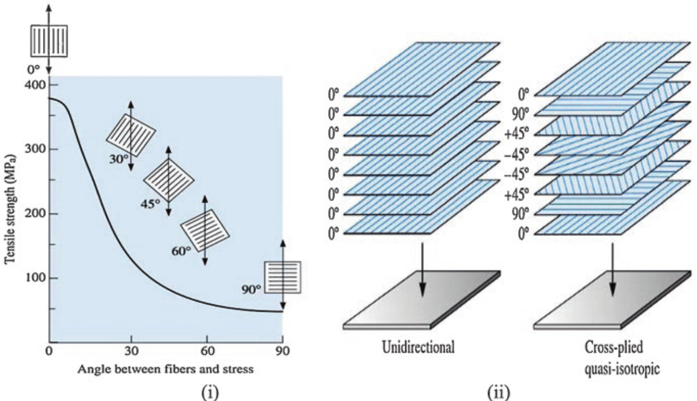

# Composite Layups

## Introduction

Composite Layups are a great way to make extremely strong yet lightweight parts. The basic concept is binding high tensile strength woven fibers with high compressive strength epoxy resins to form extremely stiff, lightweight, and strong parts. Learning composite layups give you a lot of unexplored capabilities compared to all the other fabrications methods discussed previously. Composite projects are complicated ( more or less a combination of craftsmanship, art, and science) but with sufficient research and a good understanding of the process, it should not be too intimating for more experienced makers to get into.&#x20;

#### When Should I Go With Fabricating Composite Parts?

Composites shine where you mass budget is very low yet the require load is high, in layman's term its great for projects where you want the part to be light but strong. This is why composites are so heavily used in aerospace applications. However there are reasons why composites aren't the most common sighting. Although composite material itself is often cheaper than many other materials, the manufacturing process is very time and labor consuming. Nearly all composite structures from your small model rocket parts to full sized aircraft airframes requires intensive human labor (Minus some modern automation exceptions). This means the yielding part is generally very costly to manufacture.&#x20;

Composites are also limited in application by temperature. Although its strength may often exceed metal, it can not be used near very high temperature components such as near engines (Minus exceptions where very advanced composites are produced, but this isn't available to you unless you work at Skunk Works lol). The final factor we will mention is the direction of applied forces on the part. The principles of composites relies on the tensile strength of the fibers with the compressive strength of the epoxy resin. Because fibers are often joined in the form of woven fibers, composite structures are incredibly strong when the fibers are running in the direction of the applied load, but incredibly weak when running perpendicular to the applied load (Think of it like 3D printer layer lines). Parts typically need to be designed with this in mind.

<figure><figcaption>
Source: <a href="https://www.researchgate.net/figure/i-Effect-of-fibre-orientation-on-the-tensile-strength-of-E-glass-fibre-reinforced-epoxy_fig3_344263514">https://www.researchgate.net/figure/i-Effect-of-fibre-orientation-on-the-tensile-strength-of-E-glass-fibre-reinforced-epoxy_fig3_344263514</a>
</figcaption></figure>

Deciding weather to utilize composites in your project is a equation of factoring in all the variables mentioned. Not even mentioning the tedious fabrication processes there is a lot of work involved in planning and designing composite parts. This is why often times in the enterprise space, composites are exclusively used only when the mass savings of composites is overall beneficial enough to justify the long expensive process (Or for the sake of making something luxurious and expensive because carbon fiber = +1000 more cool points).


Composites require a lot of time and resources. It is often not the most economical option for&#x20;


## Safety


Ensure you use proper PPE and responsibly operate in manageable environments! Composites can cause cancer and respiratory illness if handled improperly!


#### Respiratory

&#x20;Recent studies have suggested that dust particles from Carbon Fiber and other composites can cause very similar effects as Asbestos. In short, you really do not want to breathe any of the fibers or dust in, they can lead to serious respiratory issues (And lung cancer). Not only are loose fibers and composite dust of concern, but epoxy fumes can also cause lung irritation and brain damage. Always wear a respirator when working with composites and do it in a well-ventilated area (Preferably outdoors where the dust particulates can be diluted into the environment naturally)

#### Skin Contact

Composite fibers and dust can irritate the skin. Although less serious than lung damage, it is extremely irritating with the effect lasting for very long times (We had incidents where we had itchy skin for over a week, it's not fun trust us!). Always wear disposable gloves when handling composites, and wear a full-body Tyvek coveralls during layup jobs!

## Easy Composites Video Series

Easy Composites is well known for their excellent composite layup videos! What's really awesome is how they cover techniques utilized in enterprise settings down to more hobbyist scale projects. If your interested in getting into composites or would like to simply learn the basics, we highly recommend you to check out the playlist below.&#x20;



## Composite Layup Record

The CLR is our universal documentation sheet to keep track of all the parameters of your composite layup. It allows your job to be recorded to be replicated in the future, or troubleshoot issues that may arise.&#x20;





{% embed url="https://files.gitbook.com/v0/b/gitbook-x-prod.appspot.com/o/spaces%2FG026OYCX48grrACKRfQG%2Fuploads%2FtgkrS9qXj5zQZGSjRwhp%2FComposite%20Layup%20Record%20(CLR)v1.1.pdf?alt=media&token=0149b6d1-50f3-4c98-ab1f-2e162980a13c" %}
