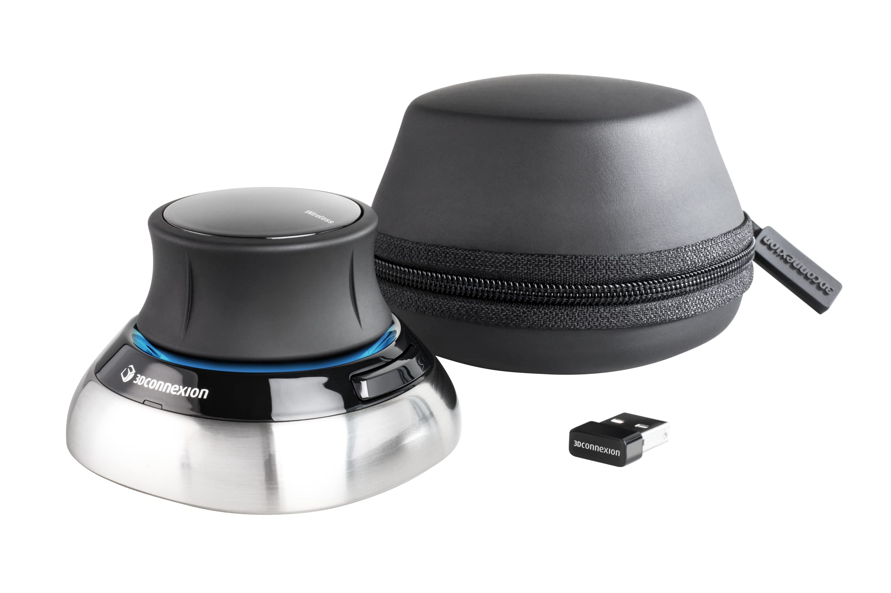

# Computer Aided Design

## Introduction

Computer-Aided Design or CAD is a software suite that allows designers to digitally draft their designs in a virtual workspace. CAD serves as the central hub between the design and manufacturing process. In modern hardware development, CAD has become the heart of. For anyone interested in CAD&#x20;

#### When Should I Use CAD?

In the majority of modern R\&D processes, there will not be a moment void of CAD. CAD is really the heart of all modern digital engineering and design processes. In our opinion, any part that needs to be repeated in the future requires revision control or needs future referencing should be designed or stored in CAD.

#### When Should I NOT Use CAD?

Strangely enough, this is a topic not spoken about enough in our opinion. CAD is probably the most efficient bridge between digital design and automated manufacturing. However, dependency to CAD seems to negatively alter our workflow in certain circumstances. For example, we may have noncritical temporary tool fixtures that are needed for only a single application, yet we find ourselves out of habit sketching the fixture in CAD. This adds unnecessary complexity to the project wasting time and resources. R\&D processes require loads of temporary parts, fixtures, or structures, and sketching these things in CAD is not the best way to start out.

## Fusion 360

Fusion 360 is our primary CAD suite we use for designing, rendering, an

### F360 in Hardware Development&#x20;

### What F360 is NOT

Fusion 360 is NOT an engineering specific software. F360 does share many engineering features with Autodesk Inventor. Inventor was catered specifically for engineering. Based on more experienced people with sufficient experience with both software suite, F360 will lacks more technical features required in advanced engineering. This does not mean F360 is not for engineering, its more of a general design software suite that includes engineering as a sub discipline. In general, Fusion 360 was highly catered for product designers (which consequently will require engineering applications). This means fusion 360 retains a good balance of features and tools for integration and fabrication of your design into manufacturing processes, basic analysis and calculations, and (this is the product design part) a great suite of tools for aesthetic works and renders.

&#x20;

### F360 Student License

If your a student like us, Fusion 360 is free to use after submitting proof of enrollment! We highly recommend you to take this opportunity since the education license offers the entire software suite at no cost.


Check out all the other software suites Autodesk has to offer for students and educators!




### F360 Hobbyist License

If your no longer a student, Autodesk offers a personal use F360 license with some immitted features. It offers the full fledged design features, so it isn't a total deal breaker. However features like simulations, PCB design, and technical drawings are completely gone or very limited. This may make this a deal breaker for people intending to use this for more



## Learning Fusion 360

### Product Design Online

Product design online offers both paid and free online CAD courses regarding Fusion 360. Everyone has different learning styles, and their tutorials may not work for you, but in our experience (and based on our learning style) it was one of the best Fusion 360 courses out there. We highly recommend new CAD users to check out their 30 min Fusion 360 crash course (It got us up and running on Fusion 360 very quickly)



### Autodesk Fusion 360 Course

In our experience the Autodesk Fusion 360 Course is not necessarily the best structured tutorial for new users. We found the overall course to be a bit lengthy with emphasis on steps that anyone even mildly experienced with most software would  be familiar with. To be fair, Autodesk had to adopt this format assuming some of the users will not have any prior digital knowledge. Our suggestion for this is to skip or skim over overly obvious steps and move on quickly. Some users may find the Autodesk course helpful, in our opinion it serves as a great didactic tool to learn more features/processes from intermediate users.&#x20;



## 3D Connexion Space Mouse

<figure><figcaption></figcaption></figure>

CAD is a three dimensional virtual work environment, but its often interfaced on a two dimensional plane with a traditionally computer mouse. The space mouse is the first true 6 axis joystick interface to utilize your non dominant hand while CAD designing or 3D modeling. We found it to very effectively make our CAD design process more fluid and efficient!

<figure><figcaption>
Demo of the fluid motions the CAD mouse offers
</figcaption></figure>


The Space Mouse is not for everyone, some experienced CAD users have expressed their preference to using a traditional computer mouse



The Space Mouse has a bit of a learning curve, it will take a about a week to get used to!



