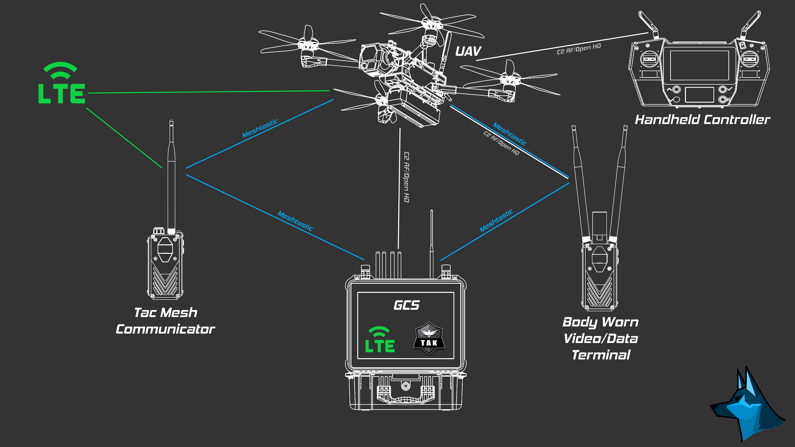

# Page 1

### **Valor sUAS System Overview**

<figure><figcaption></figcaption></figure>

Valor sUAS is a system consisting of the UAV and multiple ground devices. Multiple open-source projects have allowed the system to interoperate and relay data to multiple ground users. Valor UAV acts like an aerial LoRa Node running Meshtastic, allowing it to seamlessly integrate into a simple ATAK setup. This effectively extends the range of the network and allows personnel on the ground equipped with a Tac Mesh Communicator (Spin-off of the [RTE-1 Project](https://hackaday.io/project/184349-k-tac-rugged-t-beam-enclosure-1)) to know the location of the UAV asset. Command and Control (C2) can be managed by handheld controllers or a ground control station (GCS). For ground units that require a direct video feed from Valor, a modified Tac Mesh Communicator with an onboard video receiver can stream a live video feed from the UAV.
